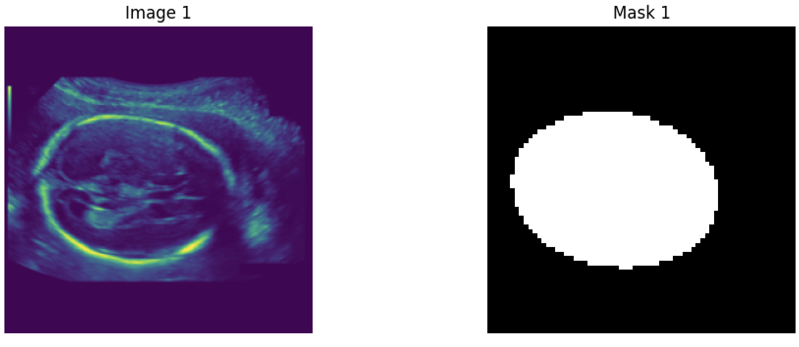
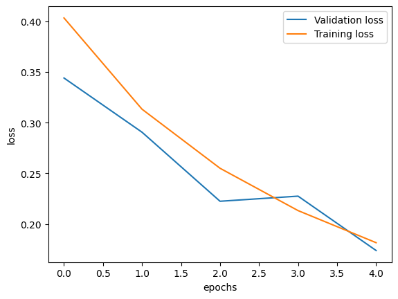

# Medical Image Segmentation with U-Net

## Project Overview

This project implements a U-Net architecture for semantic segmentation of ultrasound images. The goal is to automatically identify and segment anatomical structures in ultrasound scans. The implementation uses PyTorch and demonstrates the complete workflow from data preparation through model evaluation.

### Dataset
- The dataset consists of ultrasound images with corresponding manual segmentation masks
- Images are pre-processed to ensure uniform dimensions through padding
- Training and validation sets are created with an 80/20 split

## Model Architecture

The implementation uses the U-Net architecture, a specialized convolutional network designed for biomedical image segmentation:

### Key Components:
- **Contracting Path**: Five convolutional blocks (each with dual convolutions), decreasing spatial dimensions while increasing feature channels (1→64→128→256→512→1024)
- **Bottleneck**: 1024 feature channels at lowest resolution
- **Expanding Path**: Four transpose convolutions and convolutional blocks, increasing spatial dimensions while decreasing feature channels
- **Skip Connections**: Feature concatenation between contracting and expanding paths to preserve spatial information
- **Output Layer**: 1x1 convolution with sigmoid activation for binary segmentation

## Training Process

### Preprocessing
- Images are padded to make them square (812×812)
- Resized to 252×252 for input, with masks resized to 68×68
- Contour filling to create binary segmentation masks
  

### Training Details
- **Loss Function**: Binary Cross-Entropy (BCE)
- **Optimizer**: Adam with learning rate of 0.001
- **Epochs**: 5 (for demonstration; production would use more)

### Evaluation Metrics
- Primary metric: Dice coefficient (measures overlap between predicted and ground truth masks)
- Validation performed after each epoch
- Final evaluation on test set with visualization

## Results

### Performance Metrics
The model achieves meaningful segmentation quality as demonstrated by the Dice coefficient scores:
- **Validation Set Mean Dice Score**: `91.68%`

This high score indicates excellent overlap between predicted segmentations and ground truth masks

### Visual Results
Sample segmentation results show the model's ability to identify structures in ultrasound images:

### Learning Curves
Training showed progressive improvement in both training and validation loss over the epochs.

## Key Takeaways

- U-Net architecture is effective for ultrasound image segmentation tasks
- Skip connections are crucial for preserving spatial information during upsampling
- Data preprocessing, particularly consistent dimensions and binary mask creation, is essential for good results
- The model demonstrates good generalization from limited training data

## References

1. Ronneberger, O., Fischer, P., & Brox, T. (2015). *U-Net: Convolutional Networks for Biomedical Image Segmentation*. In Medical Image Computing and Computer-Assisted Intervention (MICCAI), 234–241. [arXiv:1505.04597](https://arxiv.org/abs/1505.04597)

2. Dataset source: [Ultrasound Nerve Segmentation Dataset on Kaggle](https://www.kaggle.com/competitions/ultrasound-nerve-segmentation/data)

